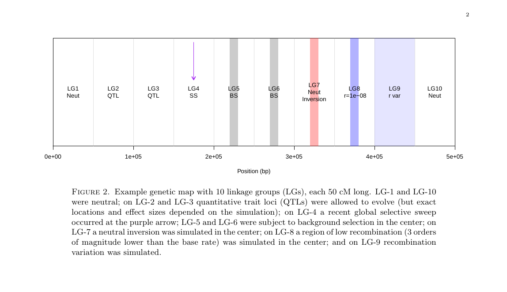

# popgen-ml

These scripts are used to implement [DiploSH/IC](http://www.g3journal.org/content/8/6/1959) on the [TTT_RecombinationGenomeScans data](https://github.com/TestTheTests/TTT_RecombinationGenomeScans/tree/master/results_final). The idea is to use the statistics calculated by various genome scans as features in a convolutional neural net (implemeneted in DiploSH/IC) in order to predict the genetic map. The current implementation classifies an entire chromosome as containing QTL sites, containing a selective sweep, under the effects of background selection, containing an inversion, containing an area of low recombination, or having a variable recombination rate.  A future version will classify each SNP in the set individaully as being in an inversion, being a QTL, etc.

## Overview of creating the feature vectors

1) Read the relevant genome scan statistics from each simulation

2) Split the statistics by chromosome

3) Split each chromosome into 11 windows (11 can be easily changed to a different number of windows)

4) For each window, calculate the mean value of each test statistic. If any mean is negative, add the smallest mean to every mean so that the smallest value is now 0. 

5) Divide each mean by the total of all the means. The statistics are now all between 0 and 1

6) Put these statistics into the appropriate feature vector file. There will be a file for neutral, low recombination, inversion etc.

## Genetic Map

## Format of feature vectors

The feature vectores have 99 columns and either 60 or 120 rows. Explanation:

`9 (number of stats) x 11 (number of windows) = 99 columns` 

`60 (number of sims) x 1 (number of chromosomes per sim that fall into each category) = 60 rows`

or 

`60 x 2 = 120 rows for neutral, QTL, background selection`

## Example feature vector snippet

This is the start of the background selection feature vector. Each feature vector has the same header, they are distinguished by the file name. 

| Hscan_v1.3_H12_win0 | Hscan_v1.3_H12_win1 | Hscan_v1.3_H12_win2 | Hscan_v1.3_H12_win3 | Hscan_v1.3_H12_win4 | Hscan_v1.3_H12_win5 | Hscan_v1.3_H12_win6 | Hscan_v1.3_H12_win7 | Hscan_v1.3_H12_win8 | Hscan_v1.3_H12_win9 | Hscan_v1.3_H12_win10 | pca_ALL_PC1_loadings_win0 | pca_ALL_PC1_loadings_win1 | pca_ALL_PC1_loadings_win2 | pca_ALL_PC1_loadings_win3 | pca_ALL_PC1_loadings_win4 | pca_ALL_PC1_loadings_win5 | pca_ALL_PC1_loadings_win6 | pca_ALL_PC1_loadings_win7 | pca_ALL_PC1_loadings_win8 | pca_ALL_PC1_loadings_win9 | pca_ALL_PC1_loadings_win10 | pca_ALL_PC2_loadings_win0 | pca_ALL_PC2_loadings_win1 | pca_ALL_PC2_loadings_win2 | pca_ALL_PC2_loadings_win3 | pca_ALL_PC2_loadings_win4 | pca_ALL_PC2_loadings_win5 | pca_ALL_PC2_loadings_win6 | pca_ALL_PC2_loadings_win7 | pca_ALL_PC2_loadings_win8 | pca_ALL_PC2_loadings_win9 | pca_ALL_PC2_loadings_win10 | pca_ALL_PC3_loadings_win0 | pca_ALL_PC3_loadings_win1 | pca_ALL_PC3_loadings_win2 | pca_ALL_PC3_loadings_win3 | pca_ALL_PC3_loadings_win4 | pca_ALL_PC3_loadings_win5 | pca_ALL_PC3_loadings_win6 | pca_ALL_PC3_loadings_win7 | pca_ALL_PC3_loadings_win8 | pca_ALL_PC3_loadings_win9 | pca_ALL_PC3_loadings_win10 | pcadapt_3.0.4_ALL_log10p_win0 | pcadapt_3.0.4_ALL_log10p_win1 | pcadapt_3.0.4_ALL_log10p_win2 | pcadapt_3.0.4_ALL_log10p_win3 | pcadapt_3.0.4_ALL_log10p_win4 | pcadapt_3.0.4_ALL_log10p_win5 | pcadapt_3.0.4_ALL_log10p_win6 | pcadapt_3.0.4_ALL_log10p_win7 | pcadapt_3.0.4_ALL_log10p_win8 | pcadapt_3.0.4_ALL_log10p_win9 | pcadapt_3.0.4_ALL_log10p_win10 | OutFLANK_0.2_ALL_log10p_win0 | OutFLANK_0.2_ALL_log10p_win1 | OutFLANK_0.2_ALL_log10p_win2 | OutFLANK_0.2_ALL_log10p_win3 | OutFLANK_0.2_ALL_log10p_win4 | OutFLANK_0.2_ALL_log10p_win5 | OutFLANK_0.2_ALL_log10p_win6 | OutFLANK_0.2_ALL_log10p_win7 | OutFLANK_0.2_ALL_log10p_win8 | OutFLANK_0.2_ALL_log10p_win9 | OutFLANK_0.2_ALL_log10p_win10 | LFMM_ridge_0.0_ALL_log10p_win0 | LFMM_ridge_0.0_ALL_log10p_win1 | LFMM_ridge_0.0_ALL_log10p_win2 | LFMM_ridge_0.0_ALL_log10p_win3 | LFMM_ridge_0.0_ALL_log10p_win4 | LFMM_ridge_0.0_ALL_log10p_win5 | LFMM_ridge_0.0_ALL_log10p_win6 | LFMM_ridge_0.0_ALL_log10p_win7 | LFMM_ridge_0.0_ALL_log10p_win8 | LFMM_ridge_0.0_ALL_log10p_win9 | LFMM_ridge_0.0_ALL_log10p_win10 | LFMM_lasso_0.0_ALL_log10p_win0 | LFMM_lasso_0.0_ALL_log10p_win1 | LFMM_lasso_0.0_ALL_log10p_win2 | LFMM_lasso_0.0_ALL_log10p_win3 | LFMM_lasso_0.0_ALL_log10p_win4 | LFMM_lasso_0.0_ALL_log10p_win5 | LFMM_lasso_0.0_ALL_log10p_win6 | LFMM_lasso_0.0_ALL_log10p_win7 | LFMM_lasso_0.0_ALL_log10p_win8 | LFMM_lasso_0.0_ALL_log10p_win9 | LFMM_lasso_0.0_ALL_log10p_win10 | Spearmans_ALL_rho_win0 | Spearmans_ALL_rho_win1 | Spearmans_ALL_rho_win2 | Spearmans_ALL_rho_win3 | Spearmans_ALL_rho_win4 | Spearmans_ALL_rho_win5 | Spearmans_ALL_rho_win6 | Spearmans_ALL_rho_win7 | Spearmans_ALL_rho_win8 | Spearmans_ALL_rho_win9 | Spearmans_ALL_rho_win10 |
| --- | --- | --- | --- | --- | --- | --- | --- | --- | --- | --- | --- | --- | --- | --- | --- | --- | --- | --- | --- | --- | --- | --- | --- | --- | --- | --- | --- | --- | --- | --- | --- | --- | --- | --- | --- | --- | --- | --- | --- | --- | --- | --- | --- | --- | --- | --- | --- | --- | --- | --- | --- | --- | --- | --- | --- | --- | --- | --- | --- | --- | --- | --- | --- | --- | --- | --- | --- | --- | --- | --- | --- | --- | --- | --- | --- | --- | --- | --- | --- | --- | --- | --- | --- | --- | --- | --- | --- | --- | --- | --- | --- | --- | --- | --- | --- | --- | --- | --- |
| 0.08199119954375288 | 0.10091500918692661 | 0.07638815235602635 | 0.09573868354242804 | 0.08211367909764869 | 0.10617773581134299 | 0.10068304188887114 | 0.08971918905900608 | 0.09164461816078633 | 0.07692918038770659 | 0.09769951096550455 | 0.12016323125163653 | 0.08465960438721999 | 0.03078107637957466 | 0.14815536601421522 | 0.055958704568974456 | 0.241940338733252 | 0.013337641107332217 | 0.0028063328386457925 | 0.16410299387767338 | 0.0 | 0.13809471084147582 | 0.07981379459430575 | 0.18747636696116238 | 0.14204316967203903 | 0.13741911518822805 | 0.14027970093965808 | 0.0 | 0.053222197473550836 | 0.039817575841166214 | 0.012328039653418516 | 0.017716185587329132 | 0.18988385408914193 | 0.05403622024498295 | 0.04248656929833249 | 0.04081800243976968 | 0.0650886829375243 | 0.06771929861523517 | 0.06814108536038513 | 0.2226492977670112 | 0.10666975928577999 | 0.17487918862325058 | 0.15751189542772867 | 0.0 | 0.11450123088519881 | 0.0720048874564438 | 0.06024560240531506 | 0.07803470972646272 | 0.11005357795072424 | 0.11196182860379689 | 0.12190847509317548 | 0.08570387407067959 | 0.08970433416293545 | 0.09105801186644119 | 0.06482346777882679 | 0.09864250186180813 | 0.1127569869574827 | 0.07107929657401287 | 0.06546488112658512 | 0.07285598234886694 | 0.06388067683215162 | 0.11281672832487842 | 0.07724010952239836 | 0.0826134856087855 | 0.10949573827302174 | 0.13315361257000852 | 0.10639158657938619 | 0.11109515237118267 | 0.08628167453081281 | 0.06731892739912884 | 0.0829597958203063 | 0.09418129107428849 | 0.09347742823388908 | 0.07569498336751793 | 0.10449611269276579 | 0.09153381517647345 | 0.08656923275424834 | 0.09101599402849339 | 0.10738905220657184 | 0.08311739821942778 | 0.08231601505530864 | 0.09782764804780202 | 0.10057652420072054 | 0.06493685916536324 | 0.08249541485376205 | 0.08358479592603439 | 0.10018091513820848 | 0.1065593831583077 | 0.17110258462974454 | 0.0 | 0.0027365645644650506 | 0.04096327322455404 | 0.09881481756150892 | 0.02830748362288956 | 0.20983521978204545 | 0.2604374650411666 | 0.004404221613804424 | 0.11302841572415956 | 0.07036995423566185 |
| 0.0876252116402615 | 0.08128441659411423 | 0.0849959871919776 | 0.08735993930544002 | 0.10081073119311461 | 0.09412069374459966 | 0.09670127629221545 | 0.10596334469175529 | 0.07851332266720118 | 0.09105426488859868 | 0.0915708117907218 | 0.008678600540952569 | 0.05368785481761639 | 0.02314909336909739 | 0.12413474829401913 | 0.008677587155535465 | 0.0235426715664531 | 0.0 | 0.02285886886016515 | 0.18063623977472945 | 0.1499099732893955 | 0.404724362332036 | 0.007023322935637788 | 0.14850978762461736 | 0.2598151371756684 | 0.15380612718330416 | 0.0723021750277667 | 0.016081521284495044 | 0.0 | 0.09152508618251455 | 0.1809484887259764 | 0.06562603930828695 | 0.00436231455173262 | 0.0 | 0.11079848781418931 | 0.13202384460917166 | 0.054164864548515705 | 0.03918265808809182 | 0.07895940553397647 | 0.1418935891497393 | 0.08914774678361627 | 0.139544325630819 | 0.11172643011510837 | 0.10255864772677194 | 0.09591055000263254 | 0.08550088219448647 | 0.09709761278128452 | 0.07094015101329824 | 0.08874296666435831 | 0.07801666149371043 | 0.13965187049819733 | 0.06208962322593449 | 0.09844678360783907 | 0.0646114083127208 | 0.11899149020553781 | 0.07941567027894933 | 0.10874006304494528 | 0.12272867151054181 | 0.08746109960334597 | 0.10606693106405388 | 0.0953176149163408 | 0.11713244908163443 | 0.05984022935537616 | 0.08477117698085948 | 0.0713701976931625 | 0.06715589647079036 | 0.1235065718434923 | 0.08319364170978166 | 0.058493832745912924 | 0.08138216600503854 | 0.08570360134681199 | 0.1021272132049416 | 0.14276387044139802 | 0.07862506727699488 | 0.09466119122985567 | 0.0849685700904683 | 0.06457427410530422 | 0.10679428276544699 | 0.07823834326849938 | 0.04873065425280592 | 0.10547341621344021 | 0.0911168750568457 | 0.10316585063673758 | 0.09192167530522705 | 0.08589117556858926 | 0.09147801604695155 | 0.11690543776678261 | 0.08028427311867378 | 0.051665123758606 | 0.06928707222546772 | 0.11578553181023084 | 0.1550478577290171 | 0.055230767490045816 | 0.17138261754157016 | 0.06640036673442723 | 0.10396504731032931 | 0.0 | 0.17981120506795323 | 0.03142441033235252 |
| 0.09651694498255356 | 0.0895650530017957 | 0.08602042434776506 | 0.07682105148502047 | 0.08230105783653496 | 0.09097985410350197 | 0.10168580346603824 | 0.08321204466173553 | 0.10424319023512114 | 0.0887522716382089 | 0.0999023042417243 | 0.09337096734447606 | 0.025885083166908365 | 0.1248692114459985 | 0.09239438156267331 | 0.16042497522730415 | 0.09982787091163577 | 0.0 | 0.05935034979323042 | 0.15125055955140015 | 0.08417393241635951 | 0.10845266858001362 | 0.041132630147802725 | 0.11295333142754536 | 0.13869348017341795 | 0.06790711910561684 | 0.11686619215943055 | 0.060377225653571724 | 0.09324630926040692 | 0.07367388476112816 | 0.0 | 0.1850761232700477 | 0.11007370404103217 | 0.12240933530799644 | 0.06982194642690005 | 0.16762203767309458 | 0.08320693265423082 | 0.09042044291510806 | 0.07339305503196532 | 0.1583032881212569 | 0.08365733712818559 | 0.02647973465461979 | 0.0 | 0.12468589008664244 | 0.06502858690585413 | 0.08294068424800002 | 0.06474526759754484 | 0.05028198943644755 | 0.10146110475891025 | 0.12760942431694447 | 0.09553363150351736 | 0.14056048743575325 | 0.10026279580652116 | 0.09275035580172006 | 0.07882567218878686 | 0.07513707994876494 | 0.13231617350444713 | 0.08887849670122448 | 0.07925766861907713 | 0.07400620693690368 | 0.11048286047671811 | 0.08003306413403104 | 0.07017342353883632 | 0.12944132776405712 | 0.05223386679903514 | 0.10803983157690496 | 0.07869423537636877 | 0.1308476147770396 | 0.10342578047632628 | 0.0804649938026004 | 0.0747620712813154 | 0.10355564033836319 | 0.08234236747251632 | 0.09246363280569964 | 0.08080959965354666 | 0.07622644612989421 | 0.0964076178863297 | 0.06751799757903908 | 0.09767373385517589 | 0.10338663376524873 | 0.06941865843574305 | 0.08687679407153683 | 0.12005614493234935 | 0.10069850415078727 | 0.09160788541899367 | 0.11032344044684274 | 0.06396981669894759 | 0.08847039064533589 | 0.06206894449065885 | 0.05211025216275336 | 0.10120069798050024 | 0.1801289007209498 | 0.05802517284373465 | 0.1501333089676341 | 0.14668910469885027 | 0.08912282691928775 | 0.0 | 0.07067054240426504 | 0.08985024881136604 |
| 0.07882033588540123 | 0.07600821892078351 | 0.09333488974094009 | 0.09897548542861134 | 0.09397902112377682 | 0.08932223814723436 | 0.08212706931683755 | 0.09511611375744701 | 0.1081485319801601 | 0.07804254576510558 | 0.10612554993370232 | 0.1272278434767546 | 0.04478758266971318 | 0.05397454189861848 | 0.11960680027557154 | 0.1618205933276999 | 0.08738050369937798 | 0.06842726828218364 | 0.11218231278030577 | 0.10078191434178177 | 0.12381063924799307 | 0.0 | 0.053881789661418274 | 0.04614585821312886 | 0.1313395036658331 | 0.12683739721299797 | 0.07569634769699803 | 0.1440331171584863 | 0.20533450394205016 | 0.09795693642141101 | 0.056973256921129305 | 0.06180128910654691 | 0.0 | 0.10350085369857843 | 0.0 | 0.19552661247485123 | 0.12389002812360153 | 0.056311154569833516 | 0.09728574224494961 | 0.11989611003024625 | 0.03294312508338733 | 0.18796767345756876 | 0.02200627855677177 | 0.060672421760211565 | 0.0973242856099624 | 0.11916422629878307 | 0.07736749327104342 | 0.09397053958206963 | 0.056008597654457336 | 0.07537479646680116 | 0.11841497621072122 | 0.05620066391806993 | 0.06782155395714477 | 0.11465167305115902 | 0.12370119397978808 | 0.09322257459937244 | 0.13283002239867933 | 0.07698531893848924 | 0.05726579333073501 | 0.06345838887353111 | 0.08544367085275362 | 0.1382477776798221 | 0.05288473431292173 | 0.06167535531412075 | 0.14698055837049206 | 0.09100580532908258 | 0.10414802360115781 | 0.08428912279852437 | 0.08156103369993192 | 0.1055825908319247 | 0.09371305685813333 | 0.0601851232345757 | 0.10258911097985414 | 0.08147754081419964 | 0.07377623222693985 | 0.09233474770509213 | 0.1203434172496663 | 0.11294676835479868 | 0.07796681032037123 | 0.1381239868027091 | 0.07920834367186436 | 0.13346570880712727 | 0.06163833521233293 | 0.06490649049421149 | 0.08865044935848099 | 0.07576004665762438 | 0.07154573714599953 | 0.09578732317448002 | 0.10328230082612784 | 0.10646614439274821 | 0.2214470729344061 | 0.19452077925909603 | 0.0089525523902917 | 0.1277504867572536 | 0.005027100063054679 | 0.019986992309726375 | 0.10913531463980715 | 0.10343125642748818 | 0.0 |
| 0.09630632237168066 | 0.08800332793624406 | 0.08963490138747734 | 0.09328987737531129 | 0.08821277693718307 | 0.10653077120778655 | 0.09694197898515516 | 0.08745319865985085 | 0.08263472063333048 | 0.08065029006893525 | 0.0903418344370451 | 0.09132532385904044 | 0.07393983682338909 | 0.10883336424261444 | 0.11941543603555813 | 0.07646934826242971 | 0.088435185317149 | 0.11758199576131152 | 0.09090779788122502 | 0.11877147616883807 | 0.11432023564844457 | 0.0 | 0.08581423141723954 | 0.09112893104425879 | 0.08485592719053031 | 0.09319163036603664 | 0.11171299545966115 | 0.12014133551368926 | 0.15028895969472172 | 0.10009169683699158 | 0.0 | 0.07279314831537456 | 0.08998114416149638 | 0.06315222993289811 | 0.11489366881866539 | 0.13066017758164508 | 0.1188461664875882 | 0.02733071295954613 | 0.10241426393315055 | 0.08814760263797461 | 0.0 | 0.17269771635318362 | 0.1057495122685594 | 0.076107949026789 | 0.08538492945228024 | 0.0906314253634668 | 0.09682715048510211 | 0.11039931373896678 | 0.08755642302887888 | 0.08438984722898597 | 0.10011490613089773 | 0.07893364540924108 | 0.11622409215928717 | 0.08010334287686126 | 0.06943492412603199 | 0.09210362499316387 | 0.05074493047636057 | 0.0865437760634695 | 0.07650001332604976 | 0.12733016358572583 | 0.0977118654347324 | 0.104294011861675 | 0.09966705194110129 | 0.08881605800808698 | 0.07428025612165283 | 0.10200824818798201 | 0.09782850883816412 | 0.08358692916627121 | 0.07792897524848323 | 0.09541854524768834 | 0.08664132717316338 | 0.12437191366265261 | 0.08726925874890805 | 0.07973273213485542 | 0.09792950019443773 | 0.07825055217984811 | 0.09104175740552771 | 0.09177877393347933 | 0.0815794688558548 | 0.08509440679389046 | 0.10532471964356811 | 0.08442310807898318 | 0.11817554383255817 | 0.07424044478730693 | 0.07792426480598415 | 0.07779773572491054 | 0.11469423906927458 | 0.08896729447418977 | 0.13265499002518344 | 0.05243082407050656 | 0.0827657972791312 | 0.12319262342993353 | 0.06883392550556891 | 0.09842605790522975 | 0.21617397106561306 | 0.08170848688423629 | 0.0 | 0.06361167233540573 | 0.08020165149919163 |
| 0.08970081282999434 | 0.08111106328857753 | 0.06328379189226475 | 0.08488230700426783 | 0.09821394972631288 | 0.11973351344387966 | 0.11658888250955687 | 0.08975358013762609 | 0.09369886737176583 | 0.08854269389882563 | 0.07449053789692851 | 0.17987499816614697 | 0.12418529634387576 | 0.16836162291860393 | 0.10257483920584361 | 0.10167327945268491 | 0.10779822379580152 | 0.11357697432649515 | 0.023501719941835277 | 0.03462222359841965 | 0.0 | 0.04383082225029342 | 0.09639798323588814 | 0.048305013904864184 | 0.0645381478919914 | 0.049043630418251695 | 0.11200006583853343 | 0.11850522990236166 | 0.05227839213717253 | 0.18318565756451866 | 0.0 | 0.2304254813609229 | 0.045320397745495386 | 0.16805749144115506 | 0.11677737883903856 | 0.043156233083764574 | 0.0420924623289284 | 0.07511685549104127 | 0.0789468654830641 | 0.11983892303372973 | 0.12843078710022438 | 0.14950446541350634 | 0.07807853778554757 | 0.0 | 0.07501492093920958 | 0.12284331656623643 | 0.1478332603590759 | 0.08428817786773722 | 0.08397261144856477 | 0.062307986897770055 | 0.0795094115960735 | 0.09468306437352324 | 0.05640935981292926 | 0.06977439367558837 | 0.12336349646329178 | 0.1165804554231009 | 0.0908228636275899 | 0.09556073498848565 | 0.1322760485038942 | 0.06361904740083128 | 0.08561109068681319 | 0.09352046435736099 | 0.1022263886920219 | 0.06282323761386865 | 0.06917688976842448 | 0.08778277893760869 | 0.05928206238716619 | 0.08447687424736137 | 0.09380752015199186 | 0.10182754296780584 | 0.09563804095273583 | 0.08466705677949803 | 0.1016721013949188 | 0.11226264400504717 | 0.07807625568007093 | 0.06115934045570302 | 0.12713056097770087 | 0.101755434037593 | 0.10070327769264793 | 0.09304411289078368 | 0.1035007078660826 | 0.09594281688386842 | 0.1053125693943656 | 0.08664118685785009 | 0.08133932270608776 | 0.08831457076403308 | 0.07423219760824383 | 0.06921380329844404 | 0.09177439321744149 | 0.01144094686686205 | 0.05765609399888073 | 0.11853836890099491 | 0.1954461539516582 | 0.11802420059303216 | 0.0 | 0.061474291756975066 | 0.14657068703910184 | 0.12990657058766442 | 0.06916829308738907 |
| 0.08694109037520169 | 0.08766512724398803 | 0.09644729008206404 | 0.07073330130310143 | 0.10475230515669703 | 0.09050281556185819 | 0.08918951726933316 | 0.11188961296999445 | 0.09407001334580396 | 0.07448687253130049 | 0.09332205416065749 | 0.12967995745688582 | 0.05602855308146886 | 0.09850695670515451 | 0.06622542006369014 | 0.116176993249556 | 0.11602465661960566 | 0.0 | 0.1655742184613327 | 0.16143974416708642 | 0.04760169369071159 | 0.04274180650450822 | 0.19003996485234498 | 0.0875237365951789 | 0.011822522480861167 | 0.0 | 0.08313095287496605 | 0.08094633115094377 | 0.08868798972478908 | 0.107163077867655 | 0.10907948417404911 | 0.13932193458406072 | 0.10228400569515138 | 0.22214047184939784 | 0.11560671282336248 | 0.12915167205957778 | 0.08744947594247375 | 0.012952075794055506 | 0.09977306963468809 | 0.0 | 0.03013451661135865 | 0.13460161949667027 | 0.03942080066807109 | 0.12876958512034448 | 0.08795295940040501 | 0.06606632806384152 | 0.07453175425721237 | 0.12228104513273022 | 0.11858570540943587 | 0.12819388092542933 | 0.1389437648473618 | 0.07882031259717033 | 0.06870853588420274 | 0.06084793796169517 | 0.05506777552051544 | 0.09169799603635467 | 0.09110829521722627 | 0.11045472432737301 | 0.0889750312188834 | 0.11149997186989292 | 0.08646881392238748 | 0.14256632353431758 | 0.0856498956534802 | 0.049025966456327376 | 0.058552275832857006 | 0.08400070593089996 | 0.08589193296205637 | 0.10283879341760242 | 0.0537282367935299 | 0.07178383176603058 | 0.08087954936870834 | 0.09437598248090756 | 0.09850691020471578 | 0.16027614753777653 | 0.09867940114602781 | 0.08710696315622313 | 0.06593225116642162 | 0.08592220374318799 | 0.09881082424825335 | 0.06625116553037506 | 0.0713148695385698 | 0.0853957745835809 | 0.08853215049160022 | 0.1049806831264988 | 0.15253811303156753 | 0.09514166854438395 | 0.08511088060368867 | 0.0660016665582937 | 0.07602327480660769 | 0.09754243556070281 | 0.2739127254999231 | 0.042562475204622745 | 0.03139082577125177 | 0.005662731370868106 | 0.029369957705245697 | 0.0 | 0.1885537701353941 | 0.12038342314942624 | 0.13459838079595773 |
| 0.09715925699539972 | 0.10481584192473906 | 0.09420865686983944 | 0.09163205663227614 | 0.07833836337067442 | 0.08411728070258466 | 0.08111195724264558 | 0.10452645230866067 | 0.0974918225767619 | 0.08067829443313264 | 0.0859200169432859 | 0.05826054064463803 | 0.0 | 0.12901432657508186 | 0.09239300474184174 | 0.1471902384741797 | 0.07605760294723113 | 0.07857615044269682 | 0.055605678230936095 | 0.13776621985174564 | 0.1752219853988605 | 0.04991425269278847 | 0.07166192261878188 | 0.0 | 0.21523250396005383 | 0.19516541498925308 | 0.09221387300883907 | 0.043147391392129114 | 0.052726870059747466 | 0.08140436237682065 | 0.1232059787837567 | 0.10906656363960782 | 0.016175119171010516 | 0.05406064466564907 | 0.05320374086517509 | 0.05169875268117921 | 0.16119481558944587 | 0.06873503713199083 | 0.06554909452673024 | 0.07376620027403474 | 0.15922455302471253 | 0.15268518236973236 | 0.1598819788713501 | 0.0 | 0.09976943412075114 | 0.12853793912009798 | 0.1144072488573464 | 0.09079780497498056 | 0.09127740635822523 | 0.058111823770223 | 0.06121461505055733 | 0.07548134629381804 | 0.11058582235727155 | 0.0760731791721662 | 0.09374337992456255 | 0.04516664852176541 | 0.10563666995525586 | 0.09309308826860424 | 0.08000696308095048 | 0.10015290795153571 | 0.09754271812801471 | 0.09001153597339591 | 0.07184791233572702 | 0.07364902535441328 | 0.13308536103505986 | 0.10980716939527757 | 0.07329839755887749 | 0.09499568349421889 | 0.08282324748434695 | 0.10128533662977741 | 0.10774006068859956 | 0.08013792771767252 | 0.08649541717415486 | 0.09623219046048574 | 0.10792561271563908 | 0.07642473716865317 | 0.0926413889075742 | 0.07388018462233308 | 0.09800230260854109 | 0.0849241126708853 | 0.09031651543398365 | 0.104579473151293 | 0.07817379125980382 | 0.08839264356148413 | 0.09430152437590023 | 0.1123687312875849 | 0.08314758508080136 | 0.09191313594738942 | 0.14279449076454293 | 0.07379434700143564 | 0.10033152861743236 | 0.09325498697571438 | 0.05806626505730333 | 0.08678372244461739 | 0.11744636278553801 | 0.10710049478565362 | 0.09016226123620563 | 0.1302655403315567 | 0.0 |
| 0.09522883012845125 | 0.09611449663838029 | 0.08789050175469913 | 0.11365911447523233 | 0.08709280047064336 | 0.10273350832858467 | 0.07591313269019667 | 0.09524586809111447 | 0.08184457892839185 | 0.08228760730949665 | 0.08198956118480923 | 0.12022098033028698 | 0.07665819349485394 | 0.16754181360758322 | 0.008038580190563333 | 0.0 | 0.12460595950660058 | 0.1127493619380372 | 0.06632518713075423 | 0.05954926642410467 | 0.17479584628866462 | 0.08951481108855114 | 0.06177899893675544 | 0.09925766648500021 | 0.08338854699579051 | 0.0992614019949284 | 0.0 | 0.10711593479901366 | 0.10234820887594162 | 0.09556205729556139 | 0.12304239193723486 | 0.11991267011248107 | 0.1083321225672928 | 0.10065097637079497 | 0.12156076243520066 | 0.008106169708190225 | 0.13826764645978432 | 0.11352249268810322 | 0.18085686245274596 | 0.0 | 0.12919359819836723 | 0.12060195109067325 | 0.06549941074611111 | 0.021740129850029096 | 0.09334848376760964 | 0.07285435953539364 | 0.08482780305537944 | 0.09861505199352093 | 0.12201949332988474 | 0.06726622221609861 | 0.08382078947587342 | 0.05187379377532678 | 0.07027364484274182 | 0.15434271058507684 | 0.10075764742309419 | 0.10998435170793748 | 0.11115039250081306 | 0.10437022533933896 | 0.11535802030388385 | 0.13279809335330794 | 0.07666753946758621 | 0.05628339749013019 | 0.0643904058151105 | 0.07158045034026235 | 0.07312383557302332 | 0.08429328810860622 | 0.10442826017203931 | 0.08342002001345483 | 0.09652080200150948 | 0.07496975482522321 | 0.09470853146775901 | 0.0777111880092479 | 0.05915712714118905 | 0.0879142334115692 | 0.1018910788993892 | 0.13486406830647277 | 0.08441493575214608 | 0.0959951855981187 | 0.09155607589696407 | 0.1217803909887567 | 0.08280623407508265 | 0.08039594735805707 | 0.07124022882662648 | 0.05667566159011569 | 0.09054444664407012 | 0.09947568821678657 | 0.12541916422681867 | 0.08411097657860325 | 0.04486375027972048 | 0.1093963297947869 | 0.13155180324419657 | 0.15430688321581565 | 0.0 | 0.038462419238096734 | 0.06905183053194751 | 0.15357875392279227 | 0.01721553928300859 | 0.15895628383164673 | 0.12261640665798847 |
