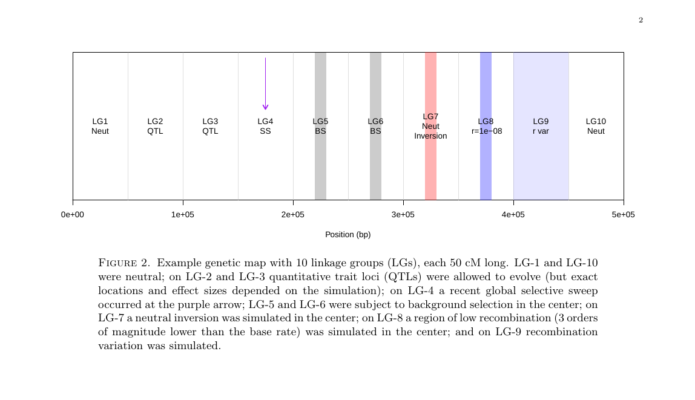
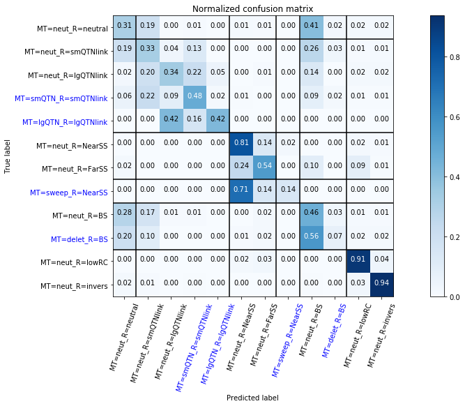

1. [Motivation And General Overview](#motivation-and-general-overview)
2. [Simulation Data](#simulation-data)
3. [Overview of the pipeline](#overview-of-the-pipeline)
    * [Run the pipeline yourself](#run-the-pipeline-yourself)
4. [Results](#results)

# Motivation and General Overview

Recent papers<sup>12</sup> by Kern and Shrider have applied supervised machine learning techniques to the problem of detecting soft and hard selective sweeps and shown that these techniques are more effective and robust than traditional methods. This led us to investigate whether such techniques could detect patterns in our TTT (Test the Tests) Recombination Genome Scans simualation data that none of the individual statistics we calculated can and whether it can discriminate between patterns of recombination and selection.

I took the existing summary statistic data, added a few more statistics used by Kern and Shrider, divided it into feature vectors, and trained an Extremely Randomized Trees classifier on the data. I calculated the effectiveness of the classifier by having it classify a previously unseen set of test data from the same simulations. The classifier was remarkably accurate, and we were particularly interested in its ability to detect QTLs (quantitative trait loci) of small effect better than the best model-based method we tested, LFMM ridge. Small QTLs can be very hard to detect using traditional methods, but many small QTLs together can have large effects on phenotype. An effective way to detect these small QTLs could reveal a lot about the underlying architecture of adaptive traits and this is the direction we plan to take the project in.

---

1) Schrider, D. R., & Kern, A. D. (2016). S/HIC: Robust identification of soft and hard sweeps using machine learning. PLOS Genetics. doi:10.1101/024547

2) Kern, A. D., & Schrider, D. R. (2018). DiploS/HIC: An updated approach to classifying selective sweeps. G3: Genes|Genomes|Genetics. doi:10.1101/267229

---

# Simulation Data

The VCFs from the simulations that were used for this project can be found in TestTheTests/TTT_RecombinationGenomeScans/results_final. The statistics calculated on them are in the same folder, in text files called "109XX_Invers_ScanResults.txt". The true labels for each site in the VCF correspond to this map:



The labels are based both on the mutation type (MT) and the region (R) of the genome. For example, a neutral mutation in the center of LG8 would be labeled "MT-Neut_R-LowRC", while a neutral mutation outside of the center of LG8 would be labeled "MT-Neut_R-LowRC". A neutral mutation close to a non-neutral muation is labeled as being in a linked region, ex: "MT-Neut_R-smQTNlinked".

---

# Overview of the pipeline

(inputs -> script.py => outputs)


1) 109XX_Invers_VCFallFILT.vcf.gz + 109XX_Invers_ScanResults.txt -> calcAdditionalStatsFromVCF.py => 109XX_Invers_ScanResults_w_sk-allel.txt 
2) 109xx_Invers_ScanResults_w_sk-all.txt-> makeFeatureVecsIndivSNPs.ipynb => feature_vec_directories/SumStatsVecs 
3) SumStatsVecs -> classify_snps.py => new_clf.p 
4) new_clf.p -> test_classifier.ipynb => diagnostic plots

There are certain statistics that were not included in the original ScanResults files that we wanted to add, so I start with the script calcAdditionalStatsFromVCF.py, which takes a directory (-d) and finds any VCFs in that directory. On the SNPs in the VCFs, it calculates the stats H12, H1/H2, Tajima's D, Watterson's Theta, Sequence Diversity (Pi), integrated haplotype score (iHS), and number of segregating sites by length (NSL) using the python package [Scikit-Allel](https://scikit-allel.readthedocs.io/en/latest/). 
It then joins these results with the original ScanResults file and outputs a ScanResults_w_sk-allel file. 


These new files are given to makeFeatureVecsIndivSNPs.ipynb, which uses Pandas to label the SNPs and split the stats into different files based on these labels. 
It also scales the stats so that they are between 0 and 1. Next, these feature vectors go to classify_snps.py, which splits them into a test set and a training set and 
uses a grid search to find the best paramteters for the extra random forest classifier (scikit-learn). Trained classifiers are stored in a pickle of the grid search object, along with the test sets. This pickle is read by test_classifier.ipynb, where the accuracy of the best classifier from the grid search is analyzed and confusion matrices are generated.

## Run the pipleline yourself

Start by cloning this repository so you have all the scripts and all the input contained in the "results_final" folder. Then run calcAdditionalStatsFromVCF.py. I provided 2 ways to doe this:

1) Run the script directly. It will process the inputs in parallel using the python multiprocessing module.

`$ python3 calcAdditionalStatsFromVCF.py -d ../results_final/ --ncpus 4`

\-d (--datadir) is required, but --ncpus will default to the maximum available if you do not provide an argument

2) Use the bash wrapper runAllelStats.sh to run the python script on one file at a time. This can provide more control, for example you could call it in a for loop to analyze only the VCFs for the sims between 10900 and 10920 instead of processing every vcf in the directory.

`$ runAllelStats.sh 10900`

This will analyze results_final/10900_Invers_VCFallFILT.vcf.gz only

<br><br>

Next, use makeFeatureVecsIndivSNPs.ipynb to divide the data into labeled feature vectors.

```python
import subprocess
import numpy as np
import pandas as pd
import sys
import warnings
import os.path
import re

fileDir  = "/media/kevin/TOSHIBA_EXT/TTT_RecombinationGenomeScans/results_final/"
outDir   = "/media/kevin/TOSHIBA_EXT/TTT_RecombinationGenomeScans/ml_project/feature_vecs_all_SK-A"
cmd      = 'ls ' + fileDir + '*ScanResults_with_sk-allel.txt'

```

This is the beginning of the first cell in the notebook. You will have to change the path for the file directory to where you stored the results_final and the name of the outDir to where you want the feature vecs to be stored. After this you should be able to run the notebook, just make sure you run the cells that define functions first.

<br>

Next, train the classifier. You can use the jupyter notebook or script version of classify SNPs. The script was created for trying out training the classifier without undersampling, since the dataset becomes so much larger I needed something that could be run on the cluster. 

```python
trainingSetDir = "/media/kevin/TOSHIBA_EXT/TTT_RecombinationGenomeScans/ml_project/feature_vecs_all_SK-A"
classifierPickleFileName = "all_sk-a_stats.p"
statsToUse = "all"
print(os.listdir(trainingSetDir)) 
```

In the second cell you will again have to edit the path. You also may want to change the name for the classfierPickle. After this the notebook should run. If you'd like, you can experiment with how much of the data is used (undersampling/oversampling), creating synthetic data using SMOTE, and with changing the range of parameters the grid search considers.

<br>

Finally, evaluate your classifier by loading it from the pickle into test_classifier.ipynb. Run the first couple cells to define the required functions, then create a new cell and run:

`plotReportForComparison("your_classifier_name.p")`

This will plot the confusion matrix. You can do a lot more investigation into your classifier than just that though. Run this line to unpack the pickle and then you can inspect the classifier itself:

`X_test, y_test, grid_search, class_names = joblib.load("your_classifier_name.p)`

grid_search is the object that holds the classifiers considered in the grid search. You can extract the best one with `grid_search.best_estimator` and then access its attributes, for example `estimator.feature_importances_` will tell you the importance of each feature (statistic) considered. Read the [sk-learn docs on the ExtraTreesClassifier](https://scikit-learn.org/stable/modules/generated/sklearn.ensemble.ExtraTreesClassifier.html) to find out what else you can do with the classifier.


---

# Results

The full results and analysis for every iteration of the classifier are stored and documented in the jupyter notebook test_classifier.ipynb, but the notebook is getting quite long so I'll present some of the most interesting results here.




This is the confusion matrix for the lastest version of the classifier. It clearly does very well at identifying the inversion and the region of low recombination (lower right corner). It can identify the sweep region well also, as could be expected from Kern and Shrider's result. The results for small and large QTNs look less impressive, but note that the classifier is attempting to separate qtls and the SNPs very close to them (linked SNPs) into different categories. Since these loci are tightly linked the signal should be expected to be very similar, and if you consider a small QTN being classified as a locus linked to a small QTN as as true positive then the results start to look a lot better. 

| precision |   recall |  f1-score |  support |
|:--------- | ------:  |---------: | --------:|
|       MT=delet_R=BS   |    0.24  |    0.07   |   0.11   |    109 |
| MT=lgQTN_R=lgQTNlink  |    0.44  |    0.42   |   0.43   |     19 |
|        MT=neut_R=BS   |    0.28  |   0.46    |   0.35   |    236 |
|     MT=neut_R=FarSS   |    0.60  |    0.54   |   0.57   |    145 |
|    MT=neut_R=NearSS   |    0.79  |    0.81   |   0.80   |    253 |
|    MT=neut_R=invers   |    0.89  |    0.94   |   0.91   |    250 |
| MT=neut_R=lgQTNlink   |    0.56  |    0.34   |   0.42   |    133 |
|     MT=neut_R=lowRC   |    0.84  |    0.91   |   0.87   |    233 |
|   MT=neut_R=neutral   |    0.35  |    0.31   |   0.33   |    264 |
| MT=neut_R=smQTNlink   |    0.32  |    0.33   |   0.32   |    240 |
| MT=smQTN_R=smQTNlink  |     0.53 |     0.48  |    0.50  |    161 |
|   MT=sweep_R=NearSS   |    0.25  |    0.14   |   0.18   |    14  |
| | | | | |
|        weighted avg   |    0.55  |    0.55   |   0.55   |   2057 |

Numerical breakdown of how well the classifier does for each class. Note that these scores do not take into account whether the classifier is mistaking the input for something close to the true category (ex small QTN mistaken for neutral linked to a small QTN).

### Comparison to LFMM Ridge

Out of the methods we investigated, the one that showed the most signal at the small QTLs was [LFMM ridge](https://bcm-uga.github.io/lfmm/articles/lfmm), a latent factor mixed model (LFMM) implemented in the lfmmm package in R. Here are some preliminary comparsions.

| Method        | True Positives | False Positives | True Negatives | False Negatives | Precsion | Recall | F1-Score |
| -----------   | -------------- | --------------  | -------------  | --------------- | -------- | -----  | -------  |
| LFMM Ridge    | 732            | 657             | 400668         | 10960           | 0.527    | 0.063  | 0.112    |
| Random Forest | 375            | 112             | 1392           | 178             | 0.77     | 0.678  | 0.721    |

Note that the comparison is limited by differences in the two methods. 
LFMM Ridge simply ouputs a score indicating whether an SNP is a QTL or is not a QTL. It does not try to discriminate between small and large QTLs or between QTLs and linked loci. Therefore, for LFMM ridge I considered small, large, and linked QTLs with an elevated score (Benjamini-Hochberg corrected q-value < 0.05) as true positives.
In order to compare the methods on a more level playing field, I also combined the small, large, and linked QTL categories in the random forest classifier output.
That is why the results in this table are higher than those in the confusion matrix -- a true positive here is a QTL or linked loci classified as **any** of the QTL classes.

You also may notice that there are significantly more data points in the LFMM ridge row. This is because LFMM ridge was tested on the whole set while the random forest was only tested on a subset of the data -- the rest of the data was used in training. 

If you are not convinced by these results, you can take a look at the Rscript compareLFMMtoML.R. This script slices up the LFMM data in a few different ways and should be easy to modify to perform new calculations. You can then compare whichever of these calculations you find the most fair to the confusion matrix above.               


 
